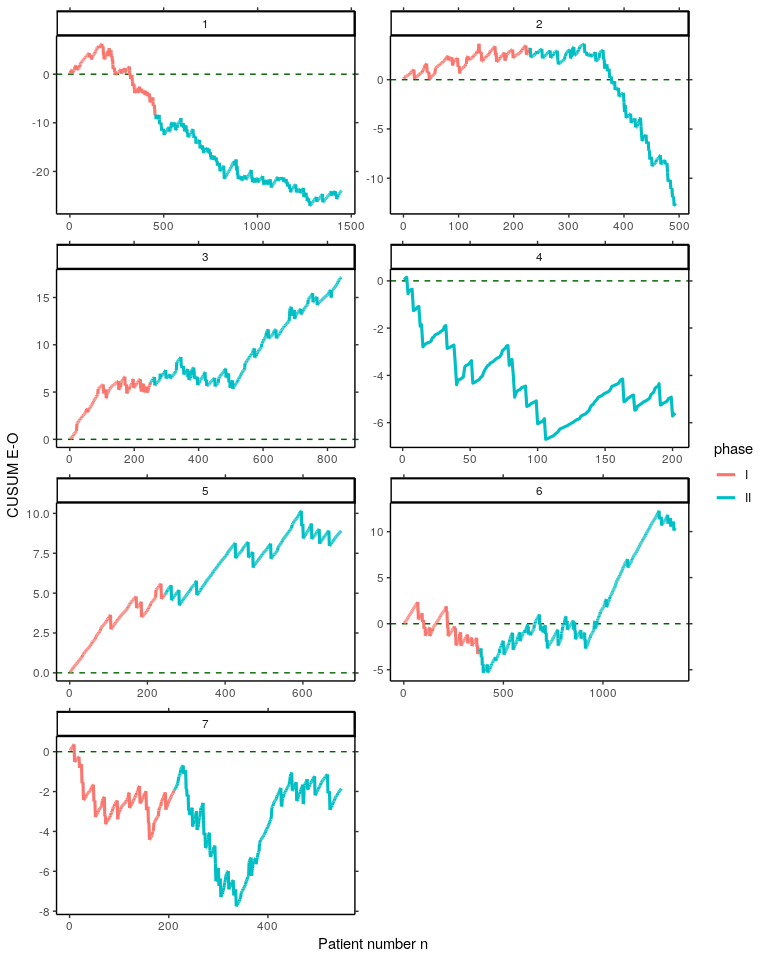
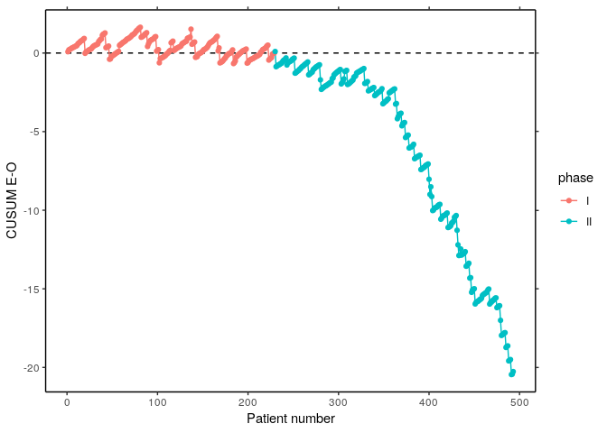

<!-- README.md is generated from README.Rmd. Please edit that file -->
vlad [](https://travis-ci.org/wittenberg/vlad) [](https://codecov.io/github/wittenberg/vlad?branch=master)
=============================================================================================================================================================================================================================================

An R-package which contains functions to set up risk-adjusted quality control charts in health care.

Main features
-------------

-   Risk-adjusted CUSUM chart based on log-likelihood ratio statistic
-   Risk-adjusted CUSUM chart based on E-O
-   Algorithms are implemented using Rcpp, RcppArmadillo
-   High performance with parallel computation

Installation
------------

You can install the released version of **vlad** from [CRAN](https://CRAN.R-project.org) with:

``` r
install.packages("vlad")
```

And the development version from [GitHub](https://github.com/) with:

``` r
# install.packages("devtools")
devtools::install_github("wittenberg/vlad")
```

Example
-------

Load libraries:

``` r
library("vlad")
library("spcadjust")
library("dplyr")
library("tidyr")
library("ggplot2")
```

Subset the dataset `cardiacsurgery` into Phase I (first two years) and Phase II (five years) and estimate a risk model based on `phaseI`.

``` r
data("cardiacsurgery")
cardiacsurgery <- cardiacsurgery %>% mutate(phase=factor(ifelse(date < 2*365, "I", "II")))
phaseI <- filter(cardiacsurgery, phase == "I")
head(cardiacsurgery)
#>   date time status Parsonnet surgeon phase
#> 1    1   90      0        15       7     I
#> 2    1   90      0         9       3     I
#> 3    2   90      0         2       5     I
#> 4    3   90      0         8       7     I
#> 5    3   90      0         7       1     I
#> 6    3   90      0        40       1     I
coeff <- round(coef(glm(status ~ Parsonnet, data=phaseI, family="binomial")), 3)
print(coeff)
#> (Intercept)   Parsonnet 
#>      -3.618       0.083
```

### Create VLADs for seven surgeons

By using the estimated risk model coefficients `coeff`, for each pair of Parsonnet score and operation outcome values, the difference between expected and observed outcome is calculated with the function `calceo`. Thereafter, differences are cummulated to create the VLAD. This is done for all seven surgeons of the `cardiacsurgery` dataset. Results are saved to the object `vlads7`.

``` r
vlads7 <- lapply(1:7, function(j){
  Si <- filter(cardiacsurgery, surgeon == j)
  EO <- sapply(seq_along(Si$Parsonnet), function(i) calceo(df=Si[i, c(4, 3)], coeff=coeff))
  select(Si, surgeon, phase) %>%  mutate(n=1:length(EO), cEO=cumsum(EO))
}) 
```

Create Variable life-adjusted Displays for each surgeon from the object `vlads7`.

``` r
vlads7 %>% 
  bind_rows() %>%  
  gather(key="Surgeon", value=value, c(-n, -surgeon, -phase)) %>%
  ggplot(aes(x=n, y=value, colour=phase, group=Surgeon)) +
    geom_hline(yintercept=0, colour="darkgreen", linetype="dashed") +
    geom_line(size = 1.1) + facet_wrap( ~ surgeon, ncol=2, scales="free") +
    labs(x="Patient number n", y="CUSUM E-O") + theme_classic() +
    scale_y_continuous(sec.axis=dup_axis(name=NULL, labels=NULL)) +
    scale_x_continuous(sec.axis=dup_axis(name=NULL, labels=NULL))
```



### Create a VLAD for surgeon 2

``` r
S2 <- subset(cardiacsurgery, c(surgeon==2), c("phase", "Parsonnet", "status"))
S2I <- subset(S2, c(phase=="I"))
S2II <- subset(S2, c(phase=="II"))
coeff <- coef(glm(status ~ Parsonnet, data=S2I, family="binomial"))
EO <- sapply(1:nrow(S2), function(i) calceo(df=S2[i, c("Parsonnet", "status")], coeff=coeff))

df1 <- data.frame(cbind(subset(S2, select=c("phase")), n=1:nrow(S2), cEO=cumsum(EO)))
df2 <- gather(df1, "variable", value, c(-n, -phase))

p1 <- ggplot(df2, aes(x=n, y=value, colour=phase)) +
  geom_hline(yintercept=0, linetype="dashed") + geom_line() + geom_point() + 
  labs(x="Patient number", y="CUSUM E-O") + theme_classic()
p1
```



### Compute thresholds of a risk-adjusted CUSUM chart for surgeon 2

Upper and lower control limits of the risk-adjusted CUSUM chart based on log-likelihood ratio statistic can be computed with the function `racusum_arl_h_sim`. The implemention uses parallel simulation and a multi-stage search procedure.

``` r
# set a random number generator for parallel computations
RNGkind("L'Ecuyer-CMRG")
# number of simulation runs
m <- 10^4
# assign cores
nc <- parallel::detectCores()
# verbose calculation 
UCL_sim <- racusum_arl_h_sim(L0=740, df=S2I[, c("Parsonnet", "status")], coeff=coeff, m=m, RA=2, nc=nc,
                             verbose=TRUE)
#> (i)   1   57.7536 
#> (ii)  2   294.0231 
#> (ii)  3   1001.1577 
#> (v)   2.63068176836489    656.7365 
#> (v)   2.71996410226231    729.0806 
#> (v)   2.73344010813922    738.9591 
#> (v)   2.73486007822752    740.8064 
#> (v)   2.73424022012152    739.5062 
#> (v)   2.7344756346214     739.9085 
#> (vi)  2.734999    740.9792
# quite calculation
LCL_sim <- racusum_arl_h_sim(L0=740, df=S2I[, c("Parsonnet", "status")], coeff=coeff, m=m, RA=1/2, 
                             nc=nc, verbose=FALSE)
round(cbind(UCL_sim, LCL_sim), 3)
#>      UCL_sim LCL_sim
#> [1,]   2.735   2.511
```

### Authors

Philipp Wittenberg and Sven Knoth

### License

GPL (&gt;= 2)
